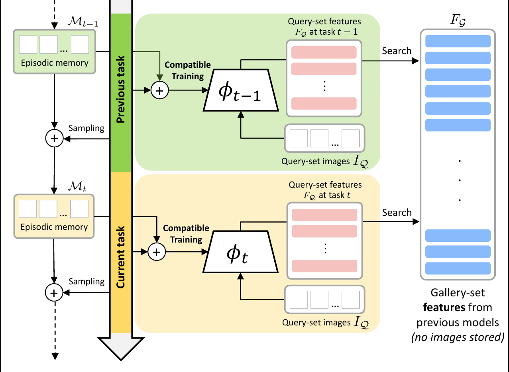

# CL<sup>2</sup>R: Compatible Lifelong Learning Representations

This repo contains the code of "CL<sup>2</sup>R: Compatible Lifelong Learning Representations", _Niccolò Biondi, Federico Pernici, Matteo Bruni, Daniele Mugnai, and Alberto Del Bimbo_, ACM Transactions on Multimedia Computing, Communications, and Applications 

Open access version on [arxiv](https://arxiv.org/abs/2211.09032)

<p align="center">
  
</p>


## Install and Train
```sh
git clone https://github.com/NiccoBiondi/CompatibleLifelongRepresentation.git
cd CompatibleLifelongRepresentation
pip install -r requirements.txt
pip install -e .

# run experiment
cl2r --config_path config.yml
```

To modify hyperparameters please modify the [config](config.yml) file.

## Authors

- Niccolò Biondi <niccolo.biondi (at) unifi.it>[](https://github.com/NiccoBiondi)
- Federico Pernici <federico.pernici (at) unifi.it> [](https://twitter.com/FedPernici)
- Matteo Bruni <matteo.bruni (at) unifi.it>[](https://github.com/matteo-bruni)
- Daniele Mugnai <mugnai.mugnai (at) gmail.com>
- Alberto Del Bimbo <alberto.delbimbo (at) unifi.it>

## Citation

If you find this code useful for your research, please cite our paper:

```
@article{biondi2023cl2r,
  title={CL2R: Compatible Lifelong Learning Representations},
  author={Biondi, Niccolo and Pernici, Federico and Bruni, Matteo and Mugnai, Daniele and Bimbo, Alberto Del},
  journal={ACM Transactions on Multimedia Computing, Communications and Applications},
  volume={18},
  number={2s},
  pages={1--22},
  year={2023},
  publisher={ACM New York, NY}
}
```


# TODO
- [ ] add creation pairs (at runtime for valiation)
- [ ] add model 
- [ ] add evaluation 
- [ ] add checkpoints saving
- [ ] add train function 
- [ ] add correct args  

